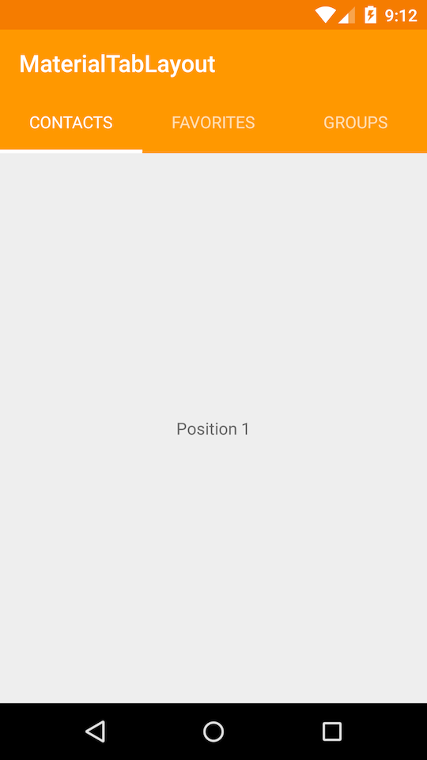
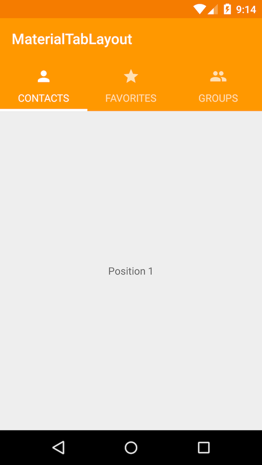

# MaterialTabs

A simple way to implement Material Design Tabs.

## INSTALL
Add this dependecy from jCenter:

## SCREENSHOTS
  

``` groovy
compile 'com.gustavofao:MaterialTabs:1.0'
```

## USAGE
To use this lib, you have to add the tab host and a viewpager on your layout:
``` xml
<com.gustavofao.materialtabs.SlidingTabLayout
        android:id="@+id/tab_host"
        android:layout_width="match_parent"
        android:layout_height="wrap_content"
        android:layout_below="@+id/toolbar"
        android:background="?attr/colorPrimary"/>
        
  <android.support.v4.view.ViewPager
        android:id="@+id/view_pager"
        android:layout_width="match_parent"
        android:layout_height="match_parent"
        android:layout_below="@+id/tab_host"/>
```

On your Activity:
``` java
    tabLayout = (SlidingTabLayout) findViewById(R.id.tab_host);
    viewPager = (ViewPager) findViewById(R.id.view_pager);
    
    viewPager.setAdapter(new TabAdapter(getSupportFragmentManager(), this));
    tabLayout.setSelectedIndicatorColors(getResources().getColor(android.R.color.white));
    tabLayout.setViewPager(viewPager);
```

These are the basic to it work. It will use the active color as white and the innactive color 70% white. To show the indicator, use setSelectedIndicatorColors(Color) with the color you want. In the Example I'm using white.

## ADAPTER
The TabAdapter extends **SlidingFragmentPagerAdapter** that extends **FragmentPagerAdapter**. To use is the same way you use FragmentPagerAdapter when going to use text must implement *getPageTitle(int position)* and when you are going to use icon needs to override *getPageDrawable(int Position)*. The sample is 
``` java
public static class TabAdapter extends SlidingFragmentPagerAdapter {
  private String[] titles = {
    "Contacts",
    "Favorites",
    "Groups",
  };

  private int[] icons = {
    R.drawable.account,
    R.drawable.star,
    R.drawable.account_multiple
  };
  ...
  @Override
  public CharSequence getPageTitle(int position) {
    return titles[position];
  }

  @Override
  public Drawable getPageDrawable(int position) {
    return context.getResources().getDrawable(icons[position]);
  }
  ...
}
```

## CUSTOMIZATION

By now you can only change the active and inactive color using the following lines:
``` java
tabLayout.setSelectedIndicatorColors(Color); //Default White
tabLayout.setCustomFocusedColor(Color); //Default 70% White
```

To change the content:
``` java
tabLayout.setTabType(TabType.TEXT_ICON); // Text and icon
tabLayout.setTabType(TabType.ICON_ONLY); // Just the icon
tabLayout.setTabType(TabType.TEXT_ONLY); // Just the text
```
## SAMPLE
The sample can be found on [this link](https://github.com/faogustavo/MaterialTabs/blob/master/sample/src/main/java/com/gustavofao/materialtablayout/sample/MainActivity.java) and its layout ou [this](https://github.com/faogustavo/MaterialTabs/blob/master/sample/src/main/res/layout/activity_main.xml).

## Thanks
[Google IOSched](https://github.com/google/iosched/) by Google.

## License
    Copyright 2015 Gustavo Fão. All rights reserved.
    
    Licensed under the Apache License, Version 2.0 (the "License");
    you may not use this file except in compliance with the License.
    You may obtain a copy of the License at
    
        http://www.apache.org/licenses/LICENSE-2.0
    
    Unless required by applicable law or agreed to in writing, software
    distributed under the License is distributed on an "AS IS" BASIS,
    WITHOUT WARRANTIES OR CONDITIONS OF ANY KIND, either express or implied.
    See the License for the specific language governing permissions and
    limitations under the License.
